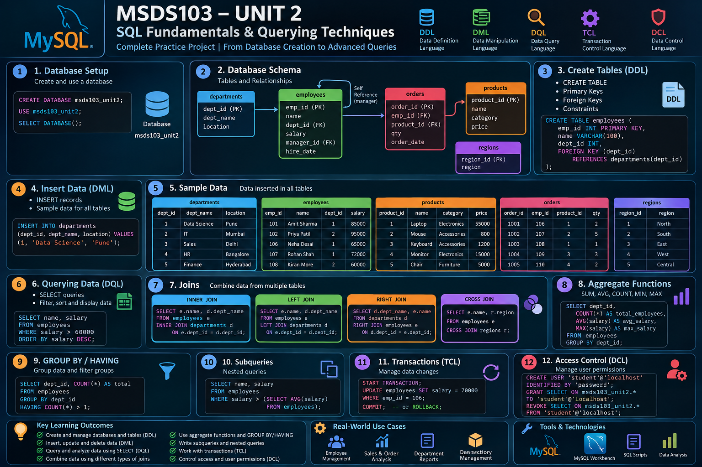

<p align="center">
  
</p>

# MSDS103 – SQL Fundamentals & Querying Techniques


A comprehensive **MySQL practice project for MSDS103** covering SQL fundamentals, database design, data manipulation, querying techniques, joins, subqueries, aggregate functions, data analysis, transactions, and access control.

---

## 📌 Project Overview

This project demonstrates practical SQL skills using a fictional business database containing:

* Departments
* Employees
* Products
* Orders
* Regions

The SQL script progresses from **database creation and table design to advanced querying, business analysis, transaction management, and user permissions**.

---

## 🗄️ Database Schema

```text
                    ┌─────────────────┐
                    │   Departments   │
                    ├─────────────────┤
                    │ dept_id (PK)    │
                    │ dept_name       │
                    │ location        │
                    └────────┬────────┘
                             │
                             │
                    ┌────────▼────────┐
                    │    Employees    │
                    ├─────────────────┤
                    │ emp_id (PK)     │
                    │ name            │
                    │ dept_id (FK)    │
                    │ salary          │
                    │ manager_id (FK) │
                    │ hire_date       │
                    └───────┬─────────┘
                            │
                            │
                    ┌───────▼─────────┐
                    │     Orders      │
                    ├─────────────────┤
                    │ order_id (PK)   │
                    │ emp_id (FK)     │
                    │ product_id (FK) │
                    │ qty             │
                    │ order_date      │
                    └───────┬─────────┘
                            │
                            │
                    ┌───────▼─────────┐
                    │    Products     │
                    ├─────────────────┤
                    │ product_id (PK) │
                    │ name            │
                    │ category        │
                    │ price           │
                    └─────────────────┘

                    ┌─────────────────┐
                    │     Regions     │
                    ├─────────────────┤
                    │ region_id (PK)  │
                    │ region          │
                    └─────────────────┘
```

---

# 📚 Topics Covered

### 1. Database Creation

* `CREATE DATABASE`
* `USE`
* `SELECT DATABASE()`

### 2. DDL – Data Definition Language

* `CREATE TABLE`
* Primary Keys
* Foreign Keys
* Constraints
* `ALTER TABLE`
* `TRUNCATE`
* `DROP`

### 3. DML – Data Manipulation Language

* `INSERT`
* `UPDATE`
* `DELETE`

### 4. DQL – Data Query Language

* `SELECT`
* Column selection
* Aliases
* `DISTINCT`
* `WHERE`
* `ORDER BY`

### 5. Filtering

* `AND`
* `OR`
* `BETWEEN`
* `IN`
* `NOT IN`
* `LIKE`
* `IS NULL`
* `IS NOT NULL`

### 6. SQL Joins

* `INNER JOIN`
* `LEFT JOIN`
* `RIGHT JOIN`
* `SELF JOIN`
* `CROSS JOIN`
* Multi-table joins

### 7. Aggregate Functions

* `COUNT()`
* `SUM()`
* `AVG()`
* `MIN()`
* `MAX()`

### 8. GROUP BY & HAVING

* Grouping records
* Filtering grouped results
* `WHERE + GROUP BY + HAVING`
* `JOIN + GROUP BY`

### 9. Subqueries

* Scalar subqueries
* `IN` subqueries
* `EXISTS`
* `NOT EXISTS`
* Correlated subqueries

### 10. Business & Revenue Analysis

* Order value calculation
* Total revenue
* Revenue by product
* Revenue by category
* Revenue by employee
* Revenue by department
* Top 5 products
* Revenue by year
* Revenue by month 

### 11. TCL – Transaction Control Language

* `START TRANSACTION`
* `COMMIT`
* `ROLLBACK`
* `SAVEPOINT`
* `ROLLBACK TO SAVEPOINT`

### 12. DCL – Data Control Language

* `CREATE USER`
* `GRANT`
* `REVOKE`
* `SHOW GRANTS`

### 13. MySQL Information Commands

* `SELECT DATABASE()`
* `SELECT USER()`
* `SELECT VERSION()`
* `SHOW DATABASES`
* `SHOW TABLES`

---

# 💰 Business Analysis Examples

The project applies SQL to practical business questions.

### Order Value

```text
Order Value = Quantity × Product Price
```

### Revenue Analysis

```text
Orders
   ↓
Employees
   ↓
Departments

Orders
   ↓
Products
   ↓
Revenue
```

Example:

```sql
SELECT
    p.name AS product,
    SUM(o.qty) AS total_quantity,
    SUM(o.qty * p.price) AS total_revenue
FROM orders o
JOIN products p
ON o.product_id = p.product_id
GROUP BY p.product_id, p.name
ORDER BY total_revenue DESC;
```

---

# 🔍 Advanced SQL Examples

### Employees Above Average Salary

```sql
SELECT name, salary
FROM employees
WHERE salary > (
    SELECT AVG(salary)
    FROM employees
);
```

### Employees Above Their Department Average

```sql
SELECT
    e.name,
    e.dept_id,
    e.salary
FROM employees e
WHERE e.salary > (
    SELECT AVG(e2.salary)
    FROM employees e2
    WHERE e2.dept_id = e.dept_id
);
```

### Employee–Manager Analysis

```sql
SELECT
    e.name AS employee,
    m.name AS manager
FROM employees e
JOIN employees m
ON e.manager_id = m.emp_id;
```

---

# 🔄 Transaction Management

The project demonstrates how database changes can be controlled safely.

```sql
START TRANSACTION;

UPDATE employees
SET salary = salary + 5000
WHERE emp_id = 106;

ROLLBACK;
```

Changes can also be permanently saved using:

```sql
COMMIT;
```

and controlled using:

```sql
SAVEPOINT
ROLLBACK TO SAVEPOINT
```

---

# 🔐 Access Control

The project also demonstrates MySQL user permissions using:

```sql
GRANT
REVOKE
SHOW GRANTS
```

> **Security Note:** The DCL section contains a practice username and password intended only for learning. Do not use the sample credentials in a production database.

---

# 🎯 Learning Outcomes

Through this project, I practiced:

* Designing relational databases
* Creating tables and relationships
* Working with primary and foreign keys
* Writing SQL queries
* Filtering and sorting data
* Combining multiple tables using joins
* Writing nested and correlated queries
* Performing statistical calculations using aggregate functions
* Using `GROUP BY` and `HAVING`
* Performing business-oriented revenue analysis
* Working with transactions
* Managing database permissions
* Using MySQL database information commands

---

# 🛠️ Tools & Technologies

| Technology          | Purpose                               |
| ------------------- | ------------------------------------- |
| **MySQL**           | Relational Database Management System |
| **SQL**             | Database querying and analysis        |
| **MySQL Workbench** | SQL development and execution         |
| **GitHub**          | Version control and project portfolio |

---

# 📂 Repository Structure

```text
MSDS103-SQL-Practice/
│
├── msds103_unit2.sql
├── sql-overview.png
└── README.md
```

---

# 🚀 How to Run

### 1. Install MySQL

Use **MySQL Workbench** or another MySQL-compatible environment.

### 2. Open the SQL file

```text
msds103_unit2.sql
```

### 3. Execute the script

Run the SQL statements sequentially.

The script will:

```text
Create Database
      ↓
Create Tables
      ↓
Insert Sample Data
      ↓
Run Basic Queries
      ↓
Perform Joins
      ↓
Run Subqueries
      ↓
Perform Aggregation
      ↓
Analyze Revenue
      ↓
Test Transactions
      ↓
Manage User Permissions
```

---

# 📌 Project Information

**Course:** MSDS103 – SQL Fundamentals and Querying Techniques
**Database:** MySQL
**Project Type:** SQL Practice & Database Analysis
**Status:** Completed

---

## 👨‍💻 Author

**Rishab Das**

M.Sc. Data Science

---

⭐ **If you find this project useful, feel free to explore the SQL queries and practice them yourself.**
